<picture>
  <source media="(prefers-color-scheme: dark)"  srcset="./assets/header.svg">
  <source media="(prefers-color-scheme: light)" srcset="./assets/header.svg">
  
</picture>

&nbsp;&nbsp;

&nbsp;&nbsp;

 

<picture>
  <source media="(prefers-color-scheme: dark)"  srcset="./assets/about.svg">
  <source media="(prefers-color-scheme: light)" srcset="./assets/about.svg">
  
</picture>

 

<picture>
  <source media="(prefers-color-scheme: dark)"  srcset="./assets/pillars.svg">
  <source media="(prefers-color-scheme: light)" srcset="./assets/pillars.svg">
  
</picture>

 

---

### `// stack`

<table>
<tr>
<td valign="top" width="50%">

</td>
<td valign="top" width="50%">

</td>
</tr>
</table>

---

### `// activity`

&nbsp;

  

---

### `// building`

 

 

